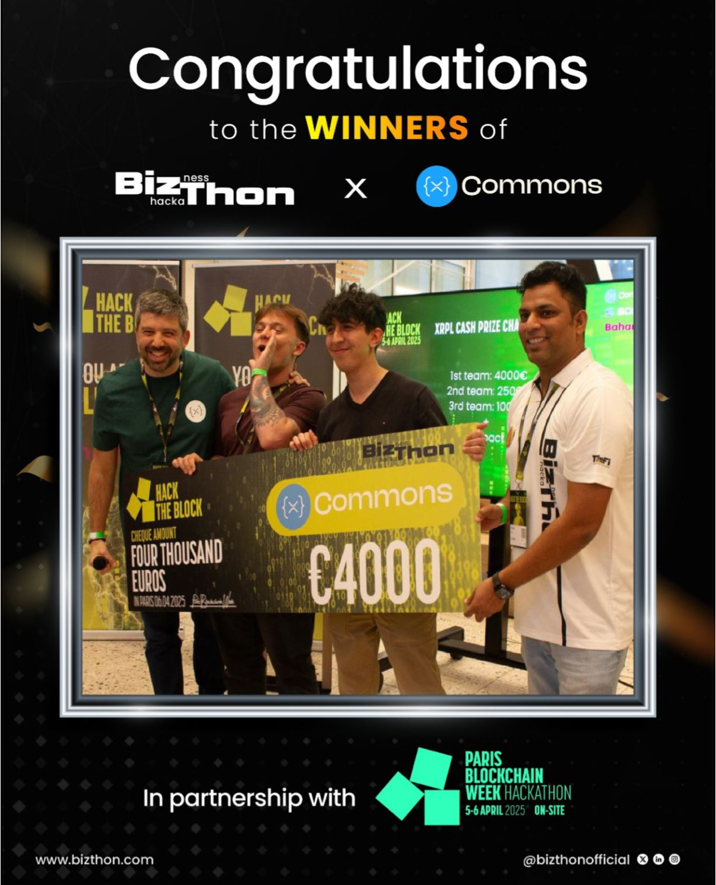

# Sentinel Wallet - Hack The Block PBW 2025

> **🏆 1st Place - XRPL Commons Track - Hack The Block PBW 2025**

## 🌟 Overview

Sentinel Wallet is a AI-powered multi-signature wallet application.
Our solution combines the power of the XRPL blockchain with advanced AI capabilities to deliver a secure and intuitive crypto asset management experience.

## 🚀 Core Features

### 🤖 AI Conversational Interface
- Natural interaction with your wallet through a conversational agent (LLM)
- Intuitive transaction and settings management
- Detailed explanations of operations in natural language
- Lot of primitive of XRPL implemented 

### ⚡ Automated Task Manager
- Schedule delayed or recurring transactions
- Triggers based on balance or on-chain activity

### 🔐 Sentinel Mode
- Real-time AI transaction analysis
- Trust and risk scoring system
- Smart recommendations (SIGN, REVIEW, or REJECT)
- AI acts as a co-signer for enhanced security
- Validation and approval of secure transactions

## 🤝 Project Team

- Omar Bajja
- Mathys Cogne-Foucault

Special thanks to XRPL Commons for the opportunity to participate in this hackathon and for the support during the event.